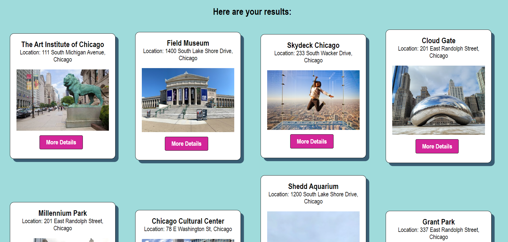

# Day Tripper App

### Description: 
This app lets you search nearby attractions and points of interest to plan out your next getaway. All trips will be within a day's driving distance, so no need to book a hotel. Day Tripper also allows you to save your favorite trips to access anytime in your trip diary! The app interfaces with Google Maps and Places API endpoints to fetch points of interests based on the user's inputted location. Favorite trips are accessed, saved, and deleted using the Day Tripper API. 

### Link to Day Tripper Live App: [https://daytripper-app.vercel.app/](https://daytripper-app.vercel.app/)
### Link to Day Tripper API Repository: [https://github.com/kaitlynyancey/daytripper-api](https://github.com/kaitlynyancey/daytripper-api)
- Documentation of the API endpoints can be found in the README file in the Day Tripper API repository. 
___
## Screenshots:

### Home Page

You can click on the navigation links in the top right corner to access the home page, the search page, and the saved trips page. Or, you can click the "Let's Go" button to go directly to the search page. 

___
### Search Page

Enter your desired location in the search box and choose a specific category to filter your results. Hit the "Let's Go" button to perform your search. 

___
### Results

Example of returned results shown below. You can click on the "More Details" button to access a map of the specific location, as well as a form to save the trip to your favorite trips.

___
### Saved Trips Page

Access your saved trips anytime by visiting the saved trips page.

___
### Technology Used
* HTML 
* CSS
* JavaScript
* React
* Node 
* PostGreSQL
* Express
